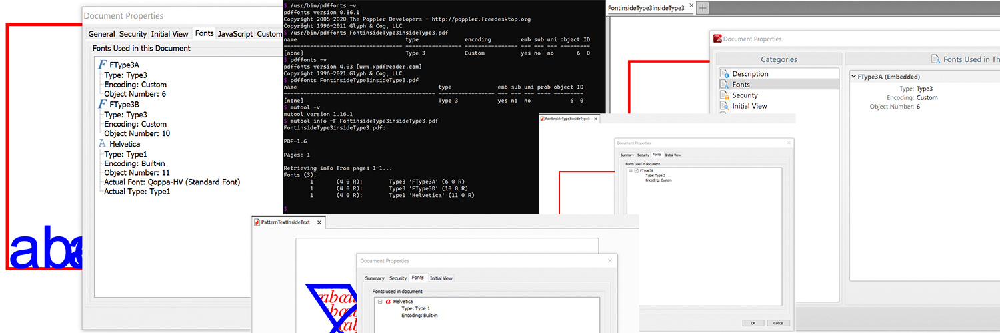
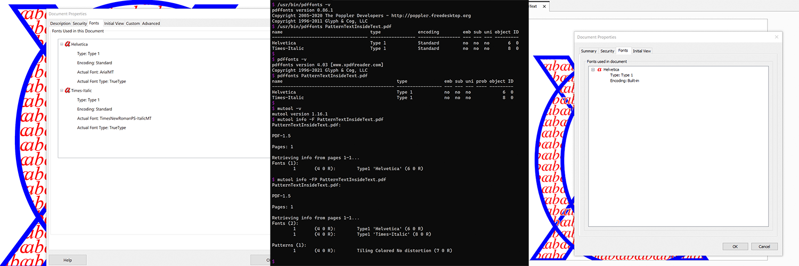
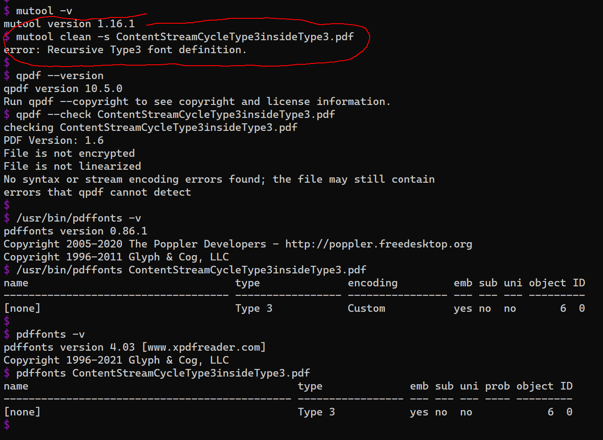
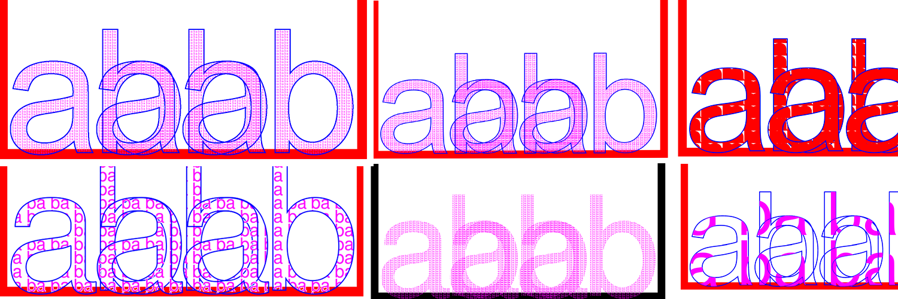
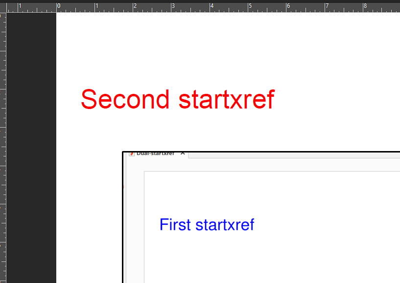

# Miscellaneous Targeted Test PDFs

A miscellaneous collection of hand-coded targeted PDF files for testing specific corner cases of the PDF specification where various PDF implementations (CLI and GUI) fail to work correctly, or not at all. This results in demonstrable parser differentials, unreliable results and significant differences for users.

## Fonts

Whether it be for long-term archival or record keeping reasons, professional printing, content extraction or reuse, or text search, many PDF workflows and use cases require an accurate understanding of fonts in a PDF.  

### [FontinsideType3insideType3.pdf](FontinsideType3insideType3.pdf)

This targeted PDF file contains one of the 14 standard PDF Type 1 fonts (non-embedded Helvetica) referenced from inside a Type 3 font which is itself then referenced from inside a different Type 3 font. It is a targeted test case for applications which supposedly report all fonts in a PDF file (such as Poppler and Xpdf `pdffonts` CLI utilities and File Properties dialogs in many interactive PDF viewers). Correct output should be a list of 3 fonts (2 x Type 3 (FType3A and FType3B) and 1 x Type 1 Helvetica). Note that Type 3 glyph descriptions are **NOT** required to clip to their widths so if the string of Helvetica characters is extended, those extra glyphs may or may not be displayed and this is **NOT an error** (officially stated in ISO 32000 as "_implementation dependent_").



### [PatternTextInsideText.pdf](PatternTextInsideText.pdf)

This targeted PDF file contains a font object referenced from inside a Shading Pattern that is then used as a fill for glyphs from a different font. Both fonts are from the 14 standard PDF Type 1 fonts and are non-embedded. It is a targeted test case for applications which supposedly report all fonts in a PDF file (such as Poppler and Xpdf `pdffonts` CLI utilities and `File | Properties` dialogs in many interactive PDF viewers).

Correct output should be a list of 2 x Type 1 fonts (Helvetica (_san serif, large blue stroked outline_) and Times-Italic (_serif, smaller red text_)). An example of a correct list of fonts for this PDF is shown in the left portion of the following image - the right portion incorrectly lists just a single font:



### [ContentStreamCycleType3insideType3.pdf](ContentStreamCycleType3insideType3.pdf)

This is a <span style="color:red;font-weight:bold;">negative test case</span> where a Type 3 glyph description stream (`CharProc`) references another Type 3 glyph description stream which then references one of the 14 standard PDF Type 1 fonts (non-embedded Helvetica) which is filled using a pattern that references back to the first Type 3 font and the same glyph description stream, thus creating an "infinite recursion" when rendering. This PDF file is only syntactically valid (i.e. at a lexical and token level), but semantically invalid because of the cycle between the Type 3 glyph description streams.



The main goal of this test file is to test for vulnerabilities such as crashes, deadlock or OOM in PDF implementations. Because this PDF is invalid, precise behavior of PDF implementations is undefined, as it is outside the scope of ISO 32000 and all legacy PDF specifications.

A recent PDF errata ([Issue #111](https://github.com/pdf-association/pdf-issues/issues/111)) acknowledges this issue with additional text to warn implementations - see [https://pdf-issues.pdfa.org/32000-2-2020/clause09.html#H9.6.4](https://pdf-issues.pdfa.org/32000-2-2020/clause09.html#H9.6.4).  

### [ContentStreamNoCycleType3insideType3.pdf](ContentStreamNoCycleType3insideType3.pdf)

This **valid** test case is almost identical to [ContentStreamCycleType3insideType3.pdf](ContentStreamCycleType3insideType3.pdf) above, however a single indirect reference of the Font resource to the Type 3 font that causes the "infinite loop" (`6 0 R`) is altered to refer to one of the 14 standard PDF Type 1 fonts (non-embedded Helvetica, `11 0 R`). Thus it is no longer an invalid PDF. The test case then becomes a rendering (_and performance!_) test case for matrix mathematics involving nested page, text, font and pattern spaces, as well as behavior related to filling and stroking, and colored and uncolored Type 3 glyphs.

This **valid** test case can also be used to confirm that all fonts are being accurately reported: correct output should be a list of 2 x Type 3 fonts and 1 x Type 1 font (Helvetica).



# Page Object

## [PDF-NoPageContents.pdf](PDF-NoPageContents.pdf)

This is a valid single page PDF that is an optimal empty page expressed via a missing `/Contents` key. The page object `/Contents` key is *optional* in all PDF specifications, and this PDF file can be used to ensure implementations correctly support this corner case. Correct rendered output is an empty page. No syntax or error messages should be generated.

# Annotations

## [LinkAnnot-appearances.pdf](LinkAnnot-appearances.pdf)

Link annotations are especially important for all interactive viewers to reliably and correctly implement as they are the PDF construct used to enable clickable URLs. With phishing and other far more serious vulnerabilities involving URLs, interactive viewers should always prompt users _before_ following any URL that is inside a PDF file. And because the URL of the Link Annotation is not "naturally visible", the URL that is to be followed should always be displayed by the viewer to the user for their explicit confirmation.

The PDF file [LinkAnnot-appearances.pdf](LinkAnnot-appearances.pdf) is a handwritten PDF and contains a Link Annotation with an appearance stream (Table 166: `/AP`). ISO 32000 states that appearance streams are optional for Link annotations, but when present "shall" be used. However a number of interactive viewers do not render the appearance stream thus creating a significant "parser differential" between viewers. Note also that this sample file also includes a green colored border (Table 166: `/Border` and `/C` entries) as well as a highlighting mode (Table 176: `/H`)

Furthermore URI Actions (which are the PDF constructs used by Link Annotations to define URLs) is specified to allow a singly linked list of URLs that should be processed _in order_ (using the `/Next` entry from Table 196). This sample PDF includes 3 such URLs in an ordered list and interactive viewers should therefore prompt users with **all 3 URLs**. The precise means by which viewers do this is not specified in ISO 32000 - but ensuring user safety should be a \#1 priority for all interactive viewers!

Thus correct behavior of the Link annotation should be:
* red "AP text click me"
* a bright green thick border around the rectangle of the link annotation
* when a user cursors over the link annotation, it should "_invert the contents of the annotation rectangle_" (i.e. some form of visual indicator for a clickable area)
* prompting the user when the Link annotation is clicked with the actual URLs

Incorrect support includes:
* blue "Hidden text click me" - indicates the Link annotation appearance stream (`/AP`) is not being rendered
* no green border - indicates the `/Border` and `/C` entries of Annotation dictionaries are being ignored
* no visual indication when hovering over the link annotation - indicates the Link annotation `/H` entry is being ignored
* no prompting of the user when the link annotation is clicked - potentially **UNSAFE** for users!
* not following all 3 URI Action URLs - URI Action `/Next` support is lacking

# File layout and structure

PDF is somewhat unusual as it requires processing from the end-of-file. In particular the PDF specification defines certain critical constructs as occurring before some other token, requiring PDF parser to correctly parse backwards. Parsing backwards is not a "natural" feature of most programming languages or regex...

## [Dual-startxref.pdf](Dual-startxref.pdf)

This handcrafted PDF has dual `startxref` entries just prior to the end-of-file marker `%%EOF`. Each `startxref` offset then points to a valid conventional cross-reference table with a particular visual rendering. According to the PDF specification in clause 7.7.7:

> The last line of the file shall contain only the end-of-file marker, %%EOF. The two preceding lines shall contain, one per line and in order, the keyword **startxref** and the byte offset in the decoded stream from the beginning of the PDF file to the beginning of the xref keyword in the last cross-reference section.

Thus the correct `startxref` is the **last** one in the file which will then use the **first** cross-reference table (as measured from top-of-file). This will then render a page using object 7 that displays a page saying "Second startxref" in red. **This is the correct output.**

An incorrect processor will use the first `startxref` (as measured from top-of-file) which will then use the **second** cross-reference table (as measured from top-of-file). This will then render a page using a _different_ object 7 that displays a page saying "First startxref" in blue. **This is incorrect output** and indicates that the "backwards parsing" from `%%EOF` to locate the correct `startxref` is incorrect.



# Encodings

## [utf16LE-test.pdf](utf16LE-test.pdf)
ISO 32000-2:2020 officially only allows UTF-8, UTF-16BE and PDFDocEncoding for text strings, as illustrated in Figure 7. However various bug reports (such as [this one](https://github.com/pikepdf/pikepdf/issues/288)) state that both extant PDF files and parsers incorrectly support UTF-16LE. This PDF attempts to test those assertions.

* The Unicode UTF16 `U+FEFF` BOM is the invisible zero-width non-breaking space/ZWNBSP character and thus shouldn't be visible in a Unicode-aware UI/GUI.
* UTF-16LE is identified by the 2-byte leading byte order marker `U+FEFF` as FF FE (hex) and is NOT a fixed-width encoding.
* UTF-16BE is identified by the 2-byte leading byte order marker `U+FEFF` as FE FF (hex) and is NOT a fixed-width encoding.
* UTF-8 (PDF 2.0) is identified by the 3-byte leading byte order marker `EF BB BF` (hex) and is NOT a fixed-width encoding.
* PDFDocEncoding does not have any leading markers.


For ASCII characters encoded in UTF-16, the padding byte is always `00` (NUL) and this is also unlikely to be visible in GUIs. Thus if a UTF-16LE string containing the BOM and only ASCII bytes with every 2nd byte being NUL is processed as PDFDocEncoding by a parser (since the BOM is _not_ as defined in ISO 32000) then a UI/GUI is likely to display just the ASCII bytes (possibly with whitespace between each character and/or leading junk bytes).

To more reliably determine if UTF-16LE support is enabled, Unicode values _beyond_ the 8-bit ASCII set need to be used, ideally where the upper byte is also a printable and visible ASCII value _**and**_ where the byte values form a valid Unicode sequence. Thus a UTF-16LE enabled PDF processor would display the Unicode character, but a non-UTF-16LE processor would display as dual 8-bit ASCII bytes (both of which would hopefully be visible). Printable bytes are ideally between `0x21` to `0x7F`, e.g., UTF-16LE `0x3022` (&#8752; UTF-16BE `U+2230`) might display as `0"` (byte `0x30` then byte `0x22`). Test strings also obviously need to have an even number of bytes in order to be valid UTF16.

```
ASCII:        "Hello world!"
ASCII as hex:  48 65 6c 6c 6f 20 77 6f 72 6c 64 21

Encoded as UTF-16BE (valid in PDF):
\ufeff\u0048\u0065\u006c\u006c\u006f\u0020\u0077\u006f\u0072\u006c\u0064\u0021

Encoded as UTF-16LE (not valid in PDF!):
\ufffe\u4800\u6500\u6c00\u6c00\u6f00\u2000\u7700\u6f00\u7200\u6c00\u6400\u2100
```

See https://www.branah.com/unicode-converter for an interactive website that demonstrates this (but only shows UTF-16BE).

For the purposes of this test file the following easy-to-recognize Unicode symbols are used (https://unicode-table.com/en/blocks/ is used as a reference):

| Unicode | UTF-16BE | As ASCII | Name |
| :-: | :-: | :-: | :-- |
| &#8752;  | `U+2230` | `"0` | [Volume integral](https://unicode-table.com/en/2230/) |
| &#10036; | `U+2734` | `'4` | [Eight pointed black star](https://unicode-table.com/en/2734/) |
| &#12880; | `U+3250` | `2P` | [Partnership Sign](https://unicode-table.com/en/3250/) |
| &#20837; | `U+5165` | `Qe` | [CJK Ideograph: enter, come in(to), join ](https://unicode-table.com/en/5165/) |
| &#9290;  | `U+244a` | `$J` | [OCR Double Backslash](https://unicode-table.com/en/244a/) |

```
UTF-16BE: \ufeff\u2230\u2734\u3250\u5165\u244a
As ASCII:         " 0   ' 4   2 P   Q e   $ J

UTF-16LE: \ufffe\u3022\u3427\u5032\u6551\u4a24
As ASCII:         0 "   4 '   P 2   e Q   J $
```

Multiple PDF features tested include outlines (a.k.a. bookmarks), optional content layer names, and DocInfo properties (often visible in a File | Properties dialog) as not all processors support all features. Both PDF hex string and literal strings are used, with explicit byte-order markers.


Left: UTF-16LE bookmarks as UTF-16LE, Right: UTF-16LE bookmarks interpreted as PDFDocEncoding

___
*This material is based upon work supported by the Defense Advanced Research Projects Agency (DARPA) under Contract No. HR001119C0079. Any opinions, findings and conclusions or recommendations expressed in this material are those of the author(s) and do not necessarily reflect the views of the Defense Advanced Research Projects Agency (DARPA). Approved for public release.*
